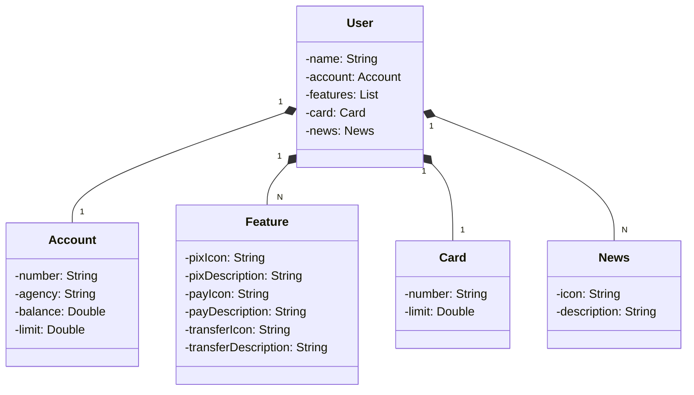

# Diagrama de classes

```mermaid
classDiagram
    class User {
        -name: String
        -account: Account
        -features: List<Feature>
        -card: Card
        -news: News
    }

    class Account {
        -number: String
        -agency: String
        -balance: Double
        -limit: Double
    }

    class Feature {
        -pixIcon: String
        -pixDescription: String
        -payIcon: String
        -payDescription: String
        -transferIcon: String
        -transferDescription: String
    }

    class Card {
        -number: String
        -limit: Double
    }

    class News {
        -icon: String
        -description: String
    }

    User "1" *-- "1" Account
    User "1" *-- "N" Feature
    User "1" *-- "1" Card
    User "1" *-- "N" News
```